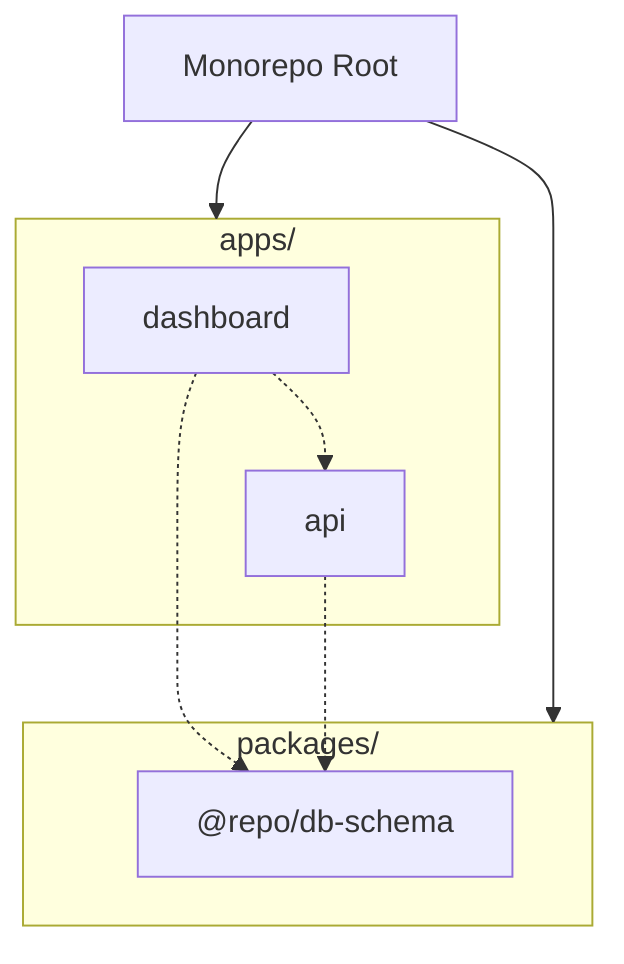

# Boilarplate Monorepo

Welcome to the **Boilarplate** monorepo! This is a modern full-stack application built with cutting-edge web technologies, featuring a high-performance backend, an interactive dashboard, and a shared database schema.

---

## 🏗️ Monorepo Structure

This project uses [Turborepo](https://turbo.build/) to manage a scalable monorepo structure containing both applications and shared packages.



### Applications (`apps/`)
- **`apps/dashboard`**: The frontend React app built with React Router 7 and Vite. This app serves as the main interactive user interface.
- **`apps/api`**: The backend service powered by Hono and running on Bun. It handles all backend business logic and connects to our core database and cache data stores.

### Packages (`packages/`)
- **`packages/db-schema`**: Shared Drizzle ORM database schemas and Zod types. This ensures type safety and a single source of truth for both the API and client applications.

---

## ⚡ Technology Stack

### Backend (`apps/api`)
- **Runtime**: [Bun](https://bun.sh/)
- **Framework**: [Hono](https://hono.dev/)
- **Authentication**: [Better Auth](https://better-auth.com/)
- **ORM & Validation**: [Drizzle ORM](https://orm.drizzle.team/) + Zod
- **Database**: PostgreSQL (via PgBouncer)
- **Cache**: Redis
- **Vector DB**: Weaviate

### Frontend (`apps/dashboard`)
- **Framework**: [React Router v7](https://reactrouter.com/)
- **Build Tool**: Vite & Cloudflare Workers support
- **Styling**: Tailwind CSS & Base UI + Radix / Shadcn components
- **Internationalization**: i18next & react-i18next

### Tooling
- **Package Manager**: [pnpm](https://pnpm.io/)
- **Monorepo Manager**: [Turborepo](https://turbo.build/)
- **Linter & Formatter**: [Biome](https://biomejs.dev/)
- **TypeScript**: Shared configs & seamless strict typing
- **Local Tunnels**: Portless (for stable dev URLs)

---

## 🚀 Prerequisites & Installation

### Prerequisites
Before you begin, ensure you have the following installed on your machine:
- [Node.js](https://nodejs.org/) (v20+ recommended)
- [Bun](https://bun.sh/) (latest)
- [pnpm](https://pnpm.io/) (v9+)
- [Docker & Docker Compose](https://www.docker.com/)

### Installation Steps

1. **Clone the repository:**
   ```bash
   git clone <repo-url>
   cd Boilarplate
   ```

2. **Install dependencies:**
   Using `pnpm` will dynamically link workspace connections automatically.
   ```bash
   pnpm install
   ```

3. **Database Schema Types Initialization:**
   Ensure your shared schema package handles type generation if needed, or check types.
   ```bash
   pnpm check-types
   ```

---

## ⚙️ Environment Setup

Local development relies on environment variables for both the API and Dashboard.

1. **Copy the Environment Templates**:
   Look for `.env.example` or `.env.template` files in the respective app directories (`apps/api/`, `apps/dashboard/`) and copy them to `.env.local` or `.env`.

2. **Automated Environment Syncing**:
   Within the API directory, a custom script helps ensure consistent environment files and validation. Run this script to generate or sync `.env` configurations:
   ```bash
   pnpm --filter @repo/api syncEnv
   ```

---

## 🐳 Docker Services Overview

For development, we rely on Docker to spin up essential backend dependencies. Our `docker-compose.yml` (located in `apps/api`) configures:

- **PostgreSQL**: Primary relational database.
- **PgBouncer**: Connection pooler for PostgreSQL.
- **Redis**: High-performance in-memory cache and message broker.
- **Weaviate**: Vector database layer for advanced AI integrations or embeddings.

To spin up your local services, use:
```bash
pnpm --filter @repo/api docker:up
```

*Note: Ensure you run `docker:down` when stopping development if needed to save resources.*

---

## 👨‍💻 Development Workflow

With Turborepo, managing the development experience is straightforward.

### Running the Entire Project
You can launch everything (API, Dashboard, and any dev scripts) simultaneously from the root:
```bash
pnpm dev
```

### Running Individual Apps

**Start only the Backend (API):**
```bash
# This starts the docker containers and the Bun Hono dev server
pnpm --filter @repo/api dev
```

**Start only the Frontend (Dashboard):**
```bash
pnpm --filter dashboard dev
```

### Key Workspace Scripts
From the root directory, you can also run:
- `pnpm build`: Builds all packages and applications via Turbo.
- `pnpm lint`: Runs Biome linter across the workspace.
- `pnpm format`: Formats code utilizing Biome.
- `pnpm check-types`: Runs TypeScript type checking workspace-wide without emitting files.

---

## 🏗️ Project Architecture

Our application is separated into a clear **Client -> Server -> Database** topology.

1. **Shared Database Layer (`packages/db-schema`)**
   Provides the core entities for our application. By utilizing Drizzle with Zod (`drizzle-zod`), we guarantee that both database schemas and API request payload types share an identical structure, eliminating duplication and desync bugs.
2. **API Backend (`apps/api`)**
   The Hono server natively handles endpoints to provide REST/RPC data. It initializes Better Auth, interacts directly with Drizzle, connects to Postgres via PgBouncer for high concurrency, and handles specialized operations (e.g., Vector DB querying via Weaviate and fast caching with Redis).
3. **Dashboard Frontend (`apps/dashboard`)**
   Uses Client-Side Rendering with React Router to communicate efficiently with the Backend via standard JSON APIs and custom hooks.

---

## 🚀 Deployment

Each application piece handles deployment differently:

- **API (`apps/api`)**:
  Built targeting the `bun` runtime via `bun build`. Typically deployed as a Docker container or directly onto a Linux VPS capable of running Bun.

- **Dashboard (`apps/dashboard`)**:
  Optimized for edge performance using Cloudflare. Build output is managed by Vite and deployed using Wrangler:
  ```bash
  pnpm --filter dashboard deploy
  ```

---

## 🤝 Contribution Guidelines & Code Quality

Maintaining high-quality code is essential across the monorepo. We employ strict quality tools to keep the codebase clean:

- **TypeScript (`tsc`)**: Strict mode is enabled. All shared types must be properly exported, ensuring safety between `api` and `dashboard`.
- **Biome (`biome check .`)**: The primary tool for both Linting and Formatting. It's configured to run extremely fast out-of-the-box. Ensure you have the Biome IDE extension installed to automatically format code on save.
- **Turborepo (`turbo run`)**: Pipeline orchestrator. Using `pnpm lint` or `pnpm build` triggers tasks logically cached by Turbo.

Before submitting code, kindly ensure that:
1. `pnpm check-types` passes.
2. `pnpm lint:fix` reports no issues.
3. Code changes do not break existing environment requirements.
